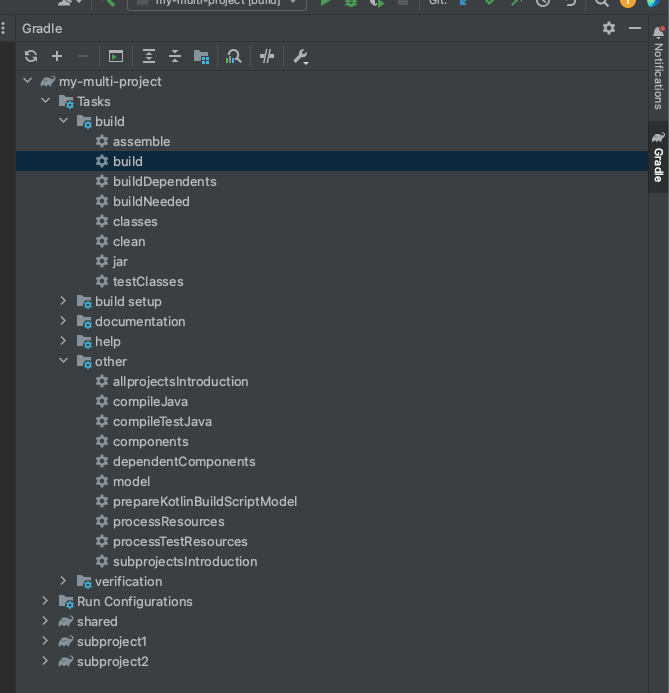

<h1>マルチプロジェクトのサンプル</h1>

<h4>ディレクトリ構成</h4>

```
$ tree -L 2
.
├── README.md
├── build
│   ├── libs
│   └── tmp
├── build.gradle
├── docs
│   └── tasks.png
├── gradle
│   └── wrapper
├── gradlew
├── gradlew.bat
├── settings.gradle
├── shared
│   ├── bin
│   ├── build
│   ├── build.gradle
│   └── src
├── subproject1
│   ├── bin
│   ├── build
│   ├── build.gradle
│   └── src
└── subproject2
    ├── bin
    ├── build
    ├── build.gradle
    └── src

19 directories, 9 files
```

<h4>タスクの実行方法</h4>

<p>gradleスクリプトでgradle taskを確認可能</p>

```
$ ./gradlew tasks

> Task :tasks

------------------------------------------------------------
Tasks runnable from root project 'my-multi-project'
------------------------------------------------------------

Build tasks
-----------
assemble - Assembles the outputs of this project.
build - Assembles and tests this project.
buildDependents - Assembles and tests this project and all projects that depend on it.
buildNeeded - Assembles and tests this project and all projects it depends on.
classes - Assembles main classes.
clean - Deletes the build directory.
jar - Assembles a jar archive containing the main classes.
testClasses - Assembles test classes.

Build Setup tasks
-----------------
init - Initializes a new Gradle build.
wrapper - Generates Gradle wrapper files.

Documentation tasks
-------------------
javadoc - Generates Javadoc API documentation for the main source code.

Help tasks
----------
buildEnvironment - Displays all buildscript dependencies declared in root project 'my-multi-project'.
dependencies - Displays all dependencies declared in root project 'my-multi-project'.
dependencyInsight - Displays the insight into a specific dependency in root project 'my-multi-project'.
help - Displays a help message.
javaToolchains - Displays the detected java toolchains.
outgoingVariants - Displays the outgoing variants of root project 'my-multi-project'.
projects - Displays the sub-projects of root project 'my-multi-project'.
properties - Displays the properties of root project 'my-multi-project'.
tasks - Displays the tasks runnable from root project 'my-multi-project' (some of the displayed tasks may belong to subprojects).

Verification tasks
------------------
check - Runs all checks.
test - Runs the test suite.

Rules
-----
Pattern: clean<TaskName>: Cleans the output files of a task.
Pattern: build<ConfigurationName>: Assembles the artifacts of a configuration.

To see all tasks and more detail, run gradlew tasks --all

To see more detail about a task, run gradlew help --task <task>

BUILD SUCCESSFUL in 310ms
1 actionable task: 1 executed
```

<p>IntelliJのGradleタブを確認することもできる</p>



<p>subpeojectsIntroduction taskとintroduction taskなども追加されていることが確認できる</p>

<p>buildタスクなどで実行可能jarを作成できる</p>

<h4>実行例</h4>

<p>build後は以下のようなコマンドで実行できる</p>

```
# subproject1 の実行方法
$ java -jar subproject1/build/libs/subproject1-0.0.1-SNAPSHOT.jar
This is subproject1 Main func
 Shared Value

# subproject2 の実行方法
$ java -jar subproject2/build/libs/subproject2-0.0.1-SNAPSHOT.jar 
This is subproject2 Main func
```